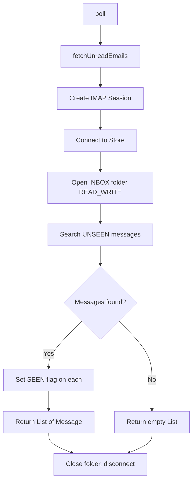

# EmailPoller IMAP Implementation Plan

## Context

`EmailPoller` is an empty class. There's a `Poller` interface with `void poll()`. The `angus-mail:2.0.5` library is declared in `dependencyManagement` but not yet added to `dependencies`. The task is to add a method that fetches unread emails from a mailbox via IMAP.

## Design Decisions

1. **Constructor injection** for IMAP connection parameters — `host`, `port`, `username`, `password` passed via constructor. Clean, testable, no framework dependency needed.
2. **EmailPoller implements Poller** — the interface already exists for this purpose.
3. **Method signature**: `List<Message> fetchUnreadEmails()` — returns raw `jakarta.mail.Message` objects filtered by the `UNSEEN` flag.
4. **Separation of concerns**: `fetchUnreadEmails()` handles the IMAP connection + search. `poll()` calls `fetchUnreadEmails()` (stub processing for now).
5. **Flag marking**: fetched emails will be marked as `SEEN` after retrieval.

## Steps

### Step 1 — Add angus-mail dependency to pom.xml

Move `angus-mail` from `dependencyManagement` to `dependencies` (keep it in `dependencyManagement` too for version locking, but add an actual entry in `dependencies`).

```xml
<dependency>
  <groupId>org.eclipse.angus</groupId>
  <artifactId>angus-mail</artifactId>
</dependency>
```

### Step 2 — Implement EmailPoller

The class will:

- Accept `host`, `port`, `username`, `password` via constructor
- Implement `Poller` interface
- Contain `fetchUnreadEmails()` method that:
  1. Creates an IMAP `Session` with SSL properties
  2. Connects and authenticates to the IMAP server
  3. Opens the INBOX folder in READ_WRITE mode
  4. Searches for messages with `Flag.SEEN = false`
  5. Sets the SEEN flag on each found message
  6. Returns the list
  7. Closes/folds the folder and disconnects in `finally` block
- `poll()` calls `fetchUnreadEmails()` as a starting point

### Key Classes from angus-mail / jakarta.mail

- `jakarta.mail.Session`
- `jakarta.mail.Store`
- `jakarta.mail.Folder`
- `jakarta.mail.Message`
- `jakarta.mail.internet.MimeMessage`
- `jakarta.mail.search.SearchTerm`
- `jakarta.mail.Flags`

## Mermaid Flow



## Files to Modify

1. `helpdesk/pom.xml` — add angus-mail dependency
2. `helpdesk/src/main/java/ru/anseranser/EmailPoller.java` — implement the class
