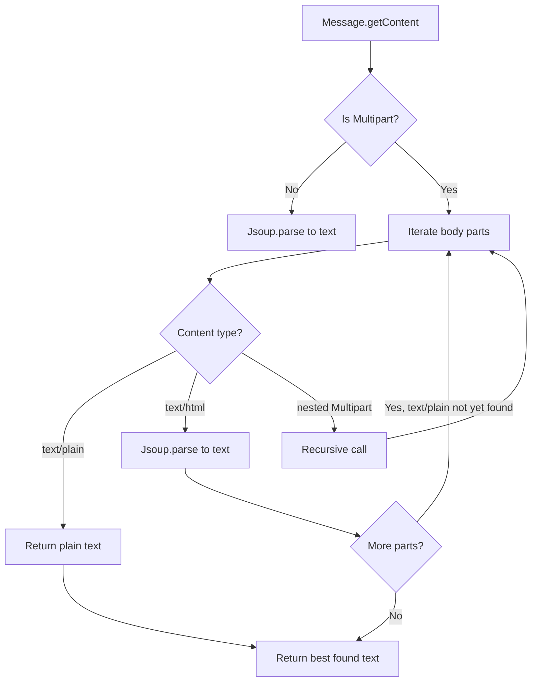

# Plan: Extract plain text from multipart emails

## Problem

In [`EmailHandler.handle()`](helpdesk/src/main/java/ru/anseranser/prod/EmailHandler.java:72), the email body is extracted with:

```java
String body = Jsoup.parse(message.getContent().toString()).text();
```

This assumes `getContent()` always returns a `String`. However, for **multipart** emails (which are very common — HTML+text emails, emails with attachments, etc.), `getContent()` returns a `jakarta.mail.Multipart` object. Calling `.toString()` on it does **not** produce the email text.

## Solution

Create a new private method `extractPlainText(Message message)` that handles all content types:

### 1. New method: `extractPlainText`

**Location:** [`EmailHandler`](helpdesk/src/main/java/ru/anseranser/prod/EmailHandler.java:28), as a new private method.

**Logic:**

```
extractPlainText(Message message):
    content = message.getContent()
    
    if content is Multipart:
        return extractTextFromMultipart(Multipart content)
    else:
        // Plain text or HTML — existing behavior
        return Jsoup.parse(content.toString()).text()
```

**Helper method: `extractTextFromMultipart`**

```
extractTextFromMultipart(Multipart multipart):
    plainText = null
    
    for i = 0 to multipart.getCount() - 1:
        bodyPart = multipart.getBodyPart(i)
        contentType = bodyPart.getContentType()
        
        if bodyPart.getContent() is Multipart:
            // Recursively handle nested multipart (e.g. multipart/alternative inside multipart/mixed)
            result = extractTextFromMultipart(nested multipart)
            if result is not null:
                plainText = result
        
        else if contentType starts with "text/plain":
            plainText = bodyPart.getContent().toString()
            break   // text/plain found, no need to continue
        
        else if contentType starts with "text/html" AND plainText is still null:
            plainText = Jsoup.parse(bodyPart.getContent().toString()).text()
            // Don't break — keep looking for text/plain which is preferred
    
    return plainText
```

**Key decisions:**
- **`text/plain` is preferred** over `text/html`. If both exist (as in `multipart/alternative`), we pick `text/plain`.
- **Recursive handling** for nested multipart structures (e.g., `multipart/mixed` containing `multipart/alternative`).
- **Jsoup is used** to strip HTML tags when falling back to an HTML part.
- **Returns `null`** if no usable text content is found (the caller handles this gracefully).

### 2. Update `handle()` method

**Location:** Line 72 in [`EmailHandler.handle()`](helpdesk/src/main/java/ru/anseranser/prod/EmailHandler.java:72)

**Before:**
```java
String body = Jsoup.parse(message.getContent().toString()).text();
```

**After:**
```java
String body = extractPlainText(message);
if (body == null || body.isBlank()) {
    System.out.println("Skipping email with empty or unreadable content from: " + from);
    continue;
}
```

### 3. New imports needed

Add to the imports section:
```java
import jakarta.mail.Multipart;
```

(`org.jsoup.Jsoup` is already imported.)

### 4. Unit tests

Add tests to [`EmailHandlerTest`](helpdesk/src/test/java/ru/anseranser/prod/EmailHandlerTest.java) or a new test class that create mock `MimeMessage` objects with different content types:

| Test case | Content type | Expected behavior |
|-----------|-------------|-------------------|
| Plain text message | `text/plain` | Returns text as-is |
| HTML message | `text/html` | Parses HTML and returns text |
| Multipart with text/plain and text/html | `multipart/alternative` | Returns `text/plain` part |
| Multipart with only text/html | `multipart/alternative` | Returns HTML parsed as text |
| Nested multipart | `multipart/mixed` containing `multipart/alternative` | Recursively finds `text/plain` |
| Empty multipart | `multipart/mixed` with no text parts | Returns `null` |

## Diagram: Content extraction flow



## Files to modify

1. [`helpdesk/src/main/java/ru/anseranser/prod/EmailHandler.java`](helpdesk/src/main/java/ru/anseranser/prod/EmailHandler.java) — add `extractPlainText` + `extractTextFromMultipart` methods, update `handle()`
2. [`helpdesk/src/test/java/ru/anseranser/prod/EmailHandlerTest.java`](helpdesk/src/test/java/ru/anseranser/prod/EmailHandlerTest.java) — add unit tests for the new method
