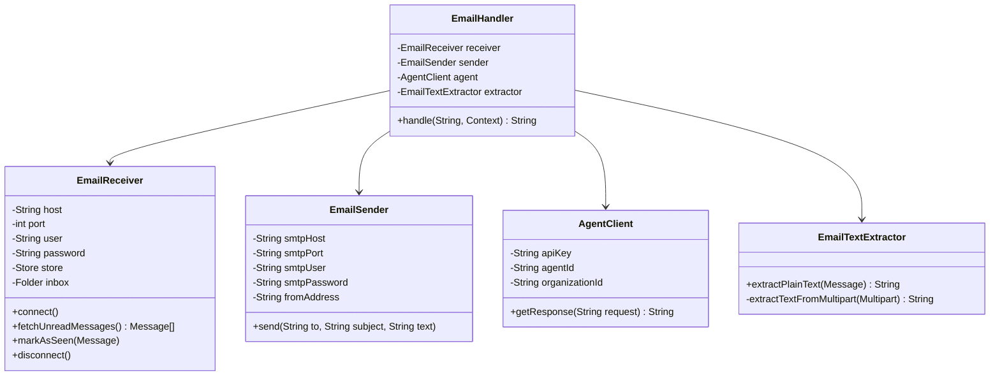

# Plan: Refactor EmailHandler into separate classes

## Current State

The monolithic [`EmailHandler`](helpdesk/src/main/java/ru/anseranser/prod/EmailHandler.java:29) class currently handles **5 distinct responsibilities** in one file:

| Responsibility | Methods |
|---|---|
| IMAP connection management | [`ensureConnected()`](helpdesk/src/main/java/ru/anseranser/prod/EmailHandler.java:201), [`disconnect()`](helpdesk/src/main/java/ru/anseranser/prod/EmailHandler.java:223), `closeQuietly()` |
| Email text extraction | [`extractPlainText()`](helpdesk/src/main/java/ru/anseranser/prod/EmailHandler.java:101), [`extractTextFromMultipart()`](helpdesk/src/main/java/ru/anseranser/prod/EmailHandler.java:118) |
| LLM agent communication | [`getAgentResponse()`](helpdesk/src/main/java/ru/anseranser/prod/EmailHandler.java:142) |
| SMTP email sending | [`sendEmail()`](helpdesk/src/main/java/ru/anseranser/prod/EmailHandler.java:170) |
| Orchestration | [`handle()`](helpdesk/src/main/java/ru/anseranser/prod/EmailHandler.java:64) |

## Target Architecture

Split into 4 focused classes + 1 orchestrator:



## New Classes

### 1. `EmailTextExtractor` — Stateless utility

No constructor parameters. Pure text extraction logic.

```
EmailTextExtractor:
  + extractPlainText(Message message) : String
  - extractTextFromMultipart(Multipart multipart) : String
```

- Moved from [`EmailHandler` lines 101-140](helpdesk/src/main/java/ru/anseranser/prod/EmailHandler.java:101)
- Dependencies: `jakarta.mail.Message`, `jakarta.mail.Multipart`, `org.jsoup.Jsoup`
- No state, no config needed

### 2. `AgentClient` — LLM agent wrapper

Constructor takes 3 config values. Creates OpenAI client on demand.

```
AgentClient:
  + AgentClient(String apiKey, String agentId, String organizationId)
  + getResponse(String request) : String
```

- Moved from [`EmailHandler` lines 142-168](helpdesk/src/main/java/ru/anseranser/prod/EmailHandler.java:142)
- Dependencies: `com.openai.client.OpenAIClient`, OpenAI SDK classes

### 3. `EmailSender` — SMTP sender

Constructor takes SMTP config. Creates a new `Session` per send call (matches current behavior).

```
EmailSender:
  + EmailSender(String host, String port, String user, String password, String fromAddress)
  + send(String to, String subject, String text) throws MessagingException
```

- Moved from [`EmailHandler` lines 170-196](helpdesk/src/main/java/ru/anseranser/prod/EmailHandler.java:170)
- Dependencies: `jakarta.mail.Session`, `jakarta.mail.Transport`, `jakarta.mail.internet.MimeMessage`

### 4. `EmailReceiver` — IMAP receiver

Manages IMAP connection lifecycle. Provides message fetching.

```
EmailReceiver:
  + EmailReceiver(String host, int port, String user, String password)
  + connect() throws MessagingException
  + fetchUnreadMessages() : Message[]
  + markAsSeen(Message) throws MessagingException
  + disconnect()
```

- Moved from [`EmailHandler` lines 198-257](helpdesk/src/main/java/ru/anseranser/prod/EmailHandler.java:198) (`ensureConnected`, `disconnect`, `closeQuietly`)
- Also incorporates the `inbox.search(new FlagTerm(...))` logic from [`handle()` line 68](helpdesk/src/main/java/ru/anseranser/prod/EmailHandler.java:68)
- Dependencies: `jakarta.mail.Store`, `jakarta.mail.Folder`, `jakarta.mail.Session`

### 5. `EmailHandler` — Orchestrator (slim)

Becomes a thin coordinator. Only reads env vars, creates components, and calls them in sequence.

```
EmailHandler:
  - EmailReceiver receiver
  - EmailSender sender
  - AgentClient agent
  - EmailTextExtractor extractor
  + EmailHandler()  // reads env vars, creates components
  + handle(String, Context) : String
  + disconnect()
```

**`handle()` pseudocode:**
```
receiver.connect()
messages = receiver.fetchUnreadMessages()
for each message:
    from = getAddress(message)
    body = extractor.extractPlainText(message)
    if body is null or blank → skip
    response = agent.getResponse(body)
    sender.send(from, "Agent answer", response)
    receiver.markAsSeen(message)
    count++
return count + " mail(s) done"
```

**`disconnect()`** just delegates to `receiver.disconnect()`.

**Utility methods** (`getAddress`, `getPersonal`) stay in `EmailHandler` since they're small helpers used only in orchestration.

## Environment variable mapping

| Component | Constructor params | Env vars |
|---|---|---|
| `EmailReceiver` | `host, port, user, password` | `IMAP_HOST, IMAP_PORT=993, IMAP_USER, IMAP_PASSWORD` |
| `EmailSender` | `host, port, user, password, fromAddress` | `SMTP_HOST, SMTP_PORT, SMTP_USER, SMTP_PASSWORD, HELPDESK_MAILBOX` |
| `AgentClient` | `apiKey, agentId, organizationId` | `YANDEX_API_KEY, AGENT_ID, ORGANIZATION_ID` |
| `EmailTextExtractor` | none | none |

## Test changes

| Existing test | What changes |
|---|---|
| [`EmailHandlerExtractTextTest`](helpdesk/src/test/java/ru/anseranser/prod/EmailHandlerExtractTextTest.java) | Rename to `EmailTextExtractorTest`, instantiate `EmailTextExtractor` directly instead of `EmailHandler` |
| [`EmailHandlerTest`](helpdesk/src/test/java/ru/anseranser/prod/EmailHandlerTest.java) | Update reflection-based field injection: now needs to inject into the sub-components, OR test `handle()` with real env vars (existing approach) |
| New tests | Consider adding unit tests for `AgentClient`, `EmailSender`, `EmailReceiver` in the future (not in scope now — they need integration/external resources) |

## Files to create

1. `helpdesk/src/main/java/ru/anseranser/prod/EmailTextExtractor.java`
2. `helpdesk/src/main/java/ru/anseranser/prod/AgentClient.java`
3. `helpdesk/src/main/java/ru/anseranser/prod/EmailSender.java`
4. `helpdesk/src/main/java/ru/anseranser/prod/EmailReceiver.java`

## Files to modify

5. `helpdesk/src/main/java/ru/anseranser/prod/EmailHandler.java` — slim down to orchestrator
6. `helpdesk/src/test/java/ru/anseranser/prod/EmailHandlerExtractTextTest.java` — update to use `EmailTextExtractor` directly

## Execution order

1. Create `EmailTextExtractor` (no dependencies on other new classes)
2. Create `AgentClient` (no dependencies on other new classes)
3. Create `EmailSender` (no dependencies on other new classes)
4. Create `EmailReceiver` (no dependencies on other new classes)
5. Refactor `EmailHandler` to use the 4 new classes
6. Update `EmailHandlerExtractTextTest` → `EmailTextExtractorTest`
7. Update `EmailHandlerTest` for the new structure
8. Build and run all tests
